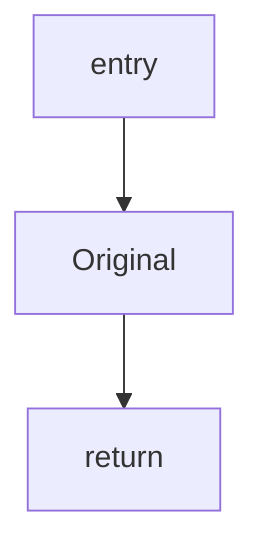
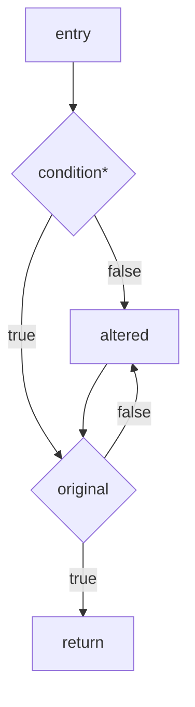

# Obfuscation analysis

# Table of contents
- [Obfuscation analysis](#obfuscation-analysis)
- [Table of contents](#table-of-contents)
- [Introduction](#introduction)
- [Obfuscation: The Art of Mathematical Deception](#obfuscation-the-art-of-mathematical-deception)
  - [What really is obfuscation ?](#what-really-is-obfuscation-)
  - [Examples of obfuscations](#examples-of-obfuscations)
    - [Obfuscate all null literals](#obfuscate-all-null-literals)
    - [Data splitting](#data-splitting)
    - [Data merging](#data-merging)
    - [Variable transformations](#variable-transformations)
    - [Array transformations](#array-transformations)
    - [Array Splitting](#array-splitting)
    - [Array Merging](#array-merging)
    - [Data Encoding](#data-encoding)
    - [Bogus Control Flows](#bogus-control-flows)
    - [Numerical Schemes](#numerical-schemes)
    - [Probabilistic control flows](#probabilistic-control-flows)
- [LLVM: A Compiler Infrastructure Overview](#llvm-a-compiler-infrastructure-overview)
- [OLLVM: Turning Intermediate Representation Into Atrocities](#ollvm-turning-intermediate-representation-into-atrocities)

# Introduction
As part of my work-study program as a reverse engineer, I'm in charge of analyzing the various layers of obfuscation in compiled code through the interfaces of the Tigress and OLLVM compilers.
The final rendering is a GUI overlay for three types of decompiler (IDA Pro, Ghidra and Binary Ninja) to enable real-time code clean-up with a native C plugin or an external Python script (which I'll have to justify with a benchmark).

Starting from the beginning, software obfuscation is a method to make programs more difficult to reverse engineer. There are multiple reasons why this is done such as protecting intellectual property, defense in depth or hiding bugs. 
No matter the reason, there are multiple ways to go about in making the software more difficult to understand, from fully manual modifications to advanced commercial obfuscation frameworks.

Before trying to de-obfuscate anything and everything, you need to understand how obfuscation works, its different application and abstraction layers, and above all how it works on LLVM and Tigress.

# Obfuscation: The Art of Mathematical Deception
A common practice in obfuscation is to use mathematics... after all, that's what computing is all about. 
So we're going to look at different mathematical expressions for obfuscation.

## What really is obfuscation ?
According to a thesis submitted for the degree of Doctor of Philosophy at the University of Oxford written by Stephen Drape; an obfuscation is a behaviour-preserving transformation whose aim is to make a program “harder to understand.” Collberg  do not define obfuscation but instead qualify “hard to understand” by using various metrics which measure the complexity of code. For example:

- **Cyclomatic Complexity** — the complexity of a function increases with the number of predicates in the function.
- **Nesting Complexity** — the complexity of a function increases with the nesting level of conditionals in the function.
- **Data-Structure Complexity** — the complexity increases with the complexity of the static data structures declared in a program. For example, the complexity of an array increases with the number of dimensions and with the complexity of the element type.

Using such metrics, Collberg  measure the potency of an obfuscation as follows. 
Let: `T` be a transformation which maps a program `P` to a program `P'`.  The potency of a transformation `T` with respect to the program `P` is defined to be:

$$
T_{\text{pot}}(P) = \frac{E(P')}{E(P)} - 1
$$

where `E(P)` is the complexity of `P` (using an appropriate metric). `T` is said to be a potent obfuscating transformation if :

$$
( T_{\text{pot}}(P) > 0 )
$$

$$
(i.e., if \space ( E(P') > E(P) ))
$$

In, `P` and `P'` are not required to be equally efficient, it is stated that many of the transformations given will result in `P'` being slower or using more memory than `P`.  Other properties that Collberg measure are:

- **Resilience** - this measures how well a transformation survives an attack from a deobfuscator. Resilience takes into account the amount of time required to construct a deobfuscator and the execution time and space actually required by the deobfuscator.
- **Execution Cost** - this measures the extra execution time and space of an obfuscated program `P'` compared with the original program `P`.
- **Quality** - this combines potency, resilience, and execution cost to give an overall measure.

These three properties are measured informally on a non-numerical scale (e.g., for resilience, the scale is trivial, weak, strong, full, one-way).

Another useful measure is the **stealth** of an obfuscation. An obfuscation is stealthy if it does not “stand out” from the rest of the program, i.e., it resembles the original code as much as possible. Stealth is context-sensitive — what is stealthy in one program may not be in another, and so it is difficult to quantify (as it depends on the whole program and also the experience of the reader).

The metrics mentioned above are not always suitable to measure the degree of obfuscation. Consider these two code fragments:

1. 
```c
if (p) {A; } else { if (q) {B; } else {C; }}
```

2. 
```c
if (p) { A; };
if (¬p ∧ q) { B; };
if (¬p ∧ ¬q) { C; }
```

These two fragments are equivalent if `A` leaves the value of `p` unchanged and `b` leaves `p` and `q` unchanged. If we transform steps (1) to steps (2), then the cyclomatic complexity is increased, but the nesting complexity is decreased. 
Then, which fragment is more obfuscated?

Barak et al. take a more formal approach to obfuscation; their notion of obfuscation is as follows. 
An obfuscator `O` is a “compiler” which takes as input a program `P` and produces a new program *`O(P)`* such that for every `P`:

- **Functionality** - `O(P)` computes the same function as `P`.
- **Polynomial Slowdown** - the description length and running time of `O(P)` are at most polynomially larger than that of `P`.
- **“Virtual black box” property** - “Anything that can be efficiently computed from `O(P)` can be efficiently computed given oracle access to `P`”.

With this definition, Barak et al. construct a family of functions that is unobfuscatable in the sense that there is no way of obfuscating programs that compute these functions. The main result of is that their notion of obfuscation is impossible to achieve.
This definition of obfuscation, in particular the “Virtual Black Box” property, is evidently too strong for our purposes, and so we consider a weaker notion. We do not consider our programs as being “black boxes,” as we assume that any attacker can inspect and modify our code. Also, we would like an indication of how “good” an obfuscation is.

## Examples of obfuscations
This section summarises some of the major obfuscations published to date.
First, we consider some of the commercial obfuscators available and  then discuss some data structure and control flow obfuscations that are not  commonly implemented by commercial obfuscators.

### Obfuscate all null literals
The process of obfuscating **all null literals** in a code is really simple. It means that we are going to replace almost all the zeroes in the code by a non-trivial boolean expression, proved to be always false.

$$
\
    \left(p_1 \ast\left(\left(x \lor a_1 \right)^{2} \right) \neq p_2 \ast\left(\left(y \lor a_2 \right)^{2} \right)\right)
\
$$

Where:
- `p1` and `p2` be _distinct_ prime numbers.
- `a1` and `a2` be _distinct_ strictly positive random numbers.
- `x` and `y` be two variables picked from the program (they have to be reachable from the obfuscation instructions).

The expression will always return a boolean zero **(false)**. The idea is to insert this test into our code, just before the 0 we want to obfuscate and to replace this 0 by the result of our comparison.
As you probably noticed  we will have to play attention to the type of the original 0 and make sure we cast the result of our expression to its type.

This type of obfuscation may not be the most sophisticated ever written, but it's enough to learn the basics of LLVM bytecode obfuscation and maybe to annoy people in reverse engineering for a few minutes... until they use a nicely crafted [miasm](https://code.google.com/archive/p/miasm/) script!

### Data splitting
The process of **data splitting / merging** involves dividing a value into several parts and then combining them when needed. To put it another way, it distributes the information of one variable into several new variables. 
For example, a boolean variable can be split into two boolean variables, and performing logical operations on them can get the original value.

$$
\text{part1} = \text{original} \land 0xFF
$$

$$
\text{part2} = \left(\text{original} \gg 8\right) \land 0xFF
$$

### Data merging
Data merging, on the other hand, aggregates several variables into one variable.
When needed, the parts are merged as follows:

$$
\text{reconstructed} = (\text{part1} << 8) \space | \space \text{part2}
$$

This makes code analysis more difficult for attackers, as the original value is never directly exposed.

### Variable transformations
To continue with variables and code complexity, we'll show how to transform an integer variable `i` within a method.
To do this, we define two functions `f` and `g`:

$$
f :: X → Y
$$

$$
g :: Y → X
$$

Where:
* `X ⊆ Z` , this represents the set of values that I take. 

We require that g is a left inverse of f (and so f needs to be injective).<br>
If `f` is bijective (injective and surjective), then `g` is often called the inverse function of `f`. This means that:

$$
g(f(x)) = x \quad \text{for all } x \in X
$$

and

$$
f(g(y)) = y \quad \text{for all } y \in Y.
$$

To replace the variable i with a new variable, j say, of type Y we need to perform two kinds of replacement depending on whether we have an assignment to i or use of i. 
An  assignment to i is a statement of the form i = V and a use of i is an occurrence of i which is not an assignment. The two replacements are : <br>
* Any assignments of `i` of the form `i = V` ar replace by `j = f(V)`
* Any uses of `i` are replaced by a *while* loop.

In other therms, this replacements can be used to obfuscate a *while* loop. [Look at this file for an example](src/variable-transformations.c)

### Array transformations
There are many ways in which arrays can be obfuscated. One of the simplest ways is to change the array indices. 
Such a change could be achieved either by a variable transformation or by defining a permutation.
Here is an example permutation for an array of size n:

$$
p = λi.(a × i + b ( mod(n))) \space where \space gcd (a, n) = 1
$$

Other array transformations involve changing the structure of an array. One way of changing the structure is by choosing different array dimensions. 
We could fold a 1-dimensional array of size m × n into a 2-dimensional array of size [m, n]. Similarly, we could flatten an n-dimensional array into a 1-dimensional array.

> [!IMPORTANT]
> Before performing array transformations, we must ensure that the arrays are safe to transform. 
 
For example, we may require that a whole array is not passed to another method or that elements of the array do not throw exceptions.

### Array Splitting
The principle of array splitting is the same as [data splitting](#data-splitting-and-merging) but applied to arrays. Collberg gave an example of a structural change called an "array split":

```c
int[] A  = new int[10];
int[] A1 = new int[5];
int[] A2 = new int[5];

// Original assignment
A[i] = ...;

// Split assignment
if ((i % 2) == 0) {
    A1[i / 2] = ...;
} else {
    A2[i / 2] = ...;
}
```

To generalize this transformation, we define a way to split an array `A` of size `n` into two new arrays, `B1` and `B2`. We use the following functions:

- `ch(i)` - a choice function that determines if an element from `A` should go into `B1` or `B2`
- `f1(i)` - a function that maps an index from `A` to `B1`
- `f2(i)` - a function that maps an index from `A` to `B2`

Let `B1` and `B2` be of sizes `m1` and `m2` respectively, where `m1 + m2 >= n`. <br>
Then, we can represent the relationship between `A`, `B1`, and `B2` as follows:

- If `ch(i)` is true, `A[i]` is assigned to `B1[f1(i)]`
- Otherwise, `A[i]` is assigned to `B2[f2(i)]`

This relationship can be represented by:

$$
A[i] =
\begin{cases}
    B_1[f_1(i)] & \text{if } ch(i) \\
    B_2[f_2(i)] & \text{otherwise}
\end{cases}
$$

To ensure that there are no index clashes, `f1` must be injective for the values for which `ch(i)` is true, and similarly for `f2`.

This relationship can be generalized so that `A` could be split into more than two arrays. In this case, `ch(i)` becomes a choice function that determines which array each element should be assigned to.

For instance, in the example above:

$$
A[i] =
\begin{cases}
    B_1[i \, \text{div} \, 2] & \text{if } i \text{ is even} \\
    B_2[i \, \text{div} \, 2] & \text{if } i \text{ is odd}
\end{cases}
$$

### Array Merging
The process of array merging is essentially the reverse of [array splitting](#array-splitting). Just as we split an array into two or more arrays, we can merge split arrays back into one. The order of elements in the new array must be determined based on the original split criteria.

For example, suppose we have arrays `B1` of size `m1` and `B2` of size `m2`, and a new array `A` of size `m1 + m2`. We can define a relationship between these arrays as follows:

$$
A[i] =
\begin{cases}
    B_1[i] & \text{if } i < m_1 \\
    B_2[i - m_1] & \text{if } i \geq m_1
\end{cases}
$$

This transformation is analogous to the concatenation of two sequences (lists).

### Data Encoding
For those familiar with reverse engineering, strings often hold critical information, including passwords, API keys, tokens, and other sensitive data. 
When reverse engineering software, these strings can provide insights into the application's functionality, making them prime targets for attackers.
To protect these strings, one might consider simply encrypting them. However, if the same encryption scheme is applied uniformly across all visible strings in the code, the effectiveness of this approach diminishes significantly. 
An adversary only needs to compromise the encryption function once to access all encrypted strings, rendering the obfuscation principle ineffective.

To illustrate this point mathematically, consider a string `S` composed of characters: $$c1, c2, ..., cn$$ 
If we use a simple symmetric encryption function `E` defined as:

$$
E(S, K) = (c_1 \oplus k_1, c_2 \oplus k_2, \ldots, c_n \oplus k_n)
$$

where:
- `K` is the key composed of `k_1, k_2, ..., k_n` ,
- `⊕`  denotes the bitwise XOR operation,

the encrypted string `E(S, K)`  results in a new string where each character is transformed based on the corresponding key character. This transformation obscures the original string, making it difficult for an unauthorized party to discern the original characters without knowledge of the key ` K` .

In this way, the mathematical foundation of encryption ensures that even with the same plaintext, varying keys will produce different ciphertexts, enhancing security through confusion and diffusion principles.

To enhance security, one effective strategy is to introduce randomness into the encryption process. 
For instance, some developers opt to use a random seed based on dynamic physical data, such as the real-time rate of radioactivity in the air at specific geographic coordinates. 
This method leverages unpredictable environmental variables to generate keys, ensuring that each encryption operation results in a unique outcome.

Mathematically, this could be expressed as:

$$
ki = H(\text{random source}(i) \,||\, \text{physical data})
$$

where:
- `H`  is a hash function that combines a unique identifier (such as the index `i`) with the unpredictable physical data.

This results in different keys for different strings, complicating reverse engineering efforts.

Beyond using randomness, developers can explore various encryption algorithms. While traditional algorithms such as **AES** (Advanced Encryption Standard) and **Elliptic Curve Cryptography (ECC)** are common, they each come with their own complexities and overheads.

1. **AES**: AES operates on blocks of data and requires a fixed key size **(128, 192, or 256 bits)**. 
It uses multiple rounds of transformation, mixing the data in a way that ensures both confidentiality and integrity.

$$
C = E_{AES}(K, P)
$$

where:
- `C`  is the ciphertext
- `P`  is the plaintext
- `K`  is the encryption key.

2. **Elliptic Curve Cryptography (ECC)**: ECC is based on the mathematics of elliptic curves and provides a higher level of security with smaller key sizes. 
It is particularly effective for scenarios where computational efficiency is critical.

$$
C = k \cdot P
$$

where:
- `C`  is the public key
- `k`  is a randomly chosen integer
- `P`  is a point on the elliptic curve.

> [!WARNING]
> While encryption adds a layer of security, it also significantly increases the complexity of a program.
> Therefore, it is essential to weigh the benefits of encryption against the potential impact on performance and maintainability.
> In some cases, simpler obfuscation techniques may suffice to deter reverse engineering without the overhead of complex encryption algorithms.
> 
> Ultimately, the choice of how to obfuscate sensitive strings must be informed by a thorough understanding of the potential threats, the capabilities of the attacker, and the operational context of the application.

### Bogus Control Flows

Bogus control flows refer to the control flows that are deliberately added to a program but will never be executed. These are often introduced as a technique to obfuscate the code, making it more difficult for an attacker to analyze or reverse engineer the software. By inserting paths that do not lead to actual execution, developers can confuse static analysis tools and human reviewers alike.

> [!WARNING]
> The inclusion of bogus control flows can significantly increase the complexity of the program. While this can serve as a protective measure, it may also lead to unintended consequences such as reduced maintainability and difficulty in debugging.
> > Refer to [McCabe's complexity](https://en.wikipedia.org/wiki/Cyclomatic_complexity) or either to [Harrison's metrics](https://dl.acm.org/doi/10.1145/947825.947829)

Before transformation:


After transformation:


### Numerical Schemes
A numerical scheme compose opaque predicates with mathematical expressions (and we love maths there).
For example, `7x²-1 ≠ y²` is constantly `true` fort all integers `x` and `y`. We can directly employ such opaque predicates to introduce **bogus control flows**.

With the following code we can demonstrate an example in which the opaque predicate guarantees that the bogus control flow (the else branch) will not be executed:
```c
// Opaque constants

int a, b;

if (7 * a * a - 1 != b * b) {
    // always true
} else {
    bogusCodes();
}
```

However, attackers would have higher chances to detect them if we employ the same opaque predicates frequently in an obfuscated program.
That's why nowadays it exist some methods to generate a family of such opaque predicates automatically, such that an obfuscator can choose a unique opaque predicate each time.
Another mathematical approach with higher security is to employ some crypto functions, such as hash function and homomorphic encryption. 

For example, we can substitute a predicate `x == c` with `H(x) == c_hash` to hide the solution of x for this equation.
> [!NOTE]
> Such an approach is generally employed by malware to evade dynamic program analysis
> We may also employ crypto functions to encrypt equations which cannot be satisfied.
> However, such opaque predicates incur much overhead.

To compose opaque constants resistant to static analysis, [Moser](https://doi.org/10.1109/acsac.2007.21) suggested employing 3-SAT problems, which are NP-hard.
This is possible because on can have efficient algorithms to compose such hard problems. It even exists a demonstration on how to compose such opaque predicates with k-clique problems.

To compose opaque constants resistant to dynamic analysis, [Wang](https://doi.org/10.1007/978-3-642-23822-2_12) proposed to compose opaque predicates with a form of unsolved conjectures which loop for many times.
Because loops are challenging for dynamic analysis, the approach in nature should be resistant to dynamic analysis.

Examples of such conjectures include Collatz conjecture, `5x+1` conjecture, Matthews conjecture. 
See the code below to understand how to employ Collatz conjecture to introduce bogus control flows.
```c++
// Collatz conjecture

int x; // for any x > 0

while (x > 1) {
    if (x % 2 == 1) { // x is odd
        x *= 3+1;
    } else {
        x /= 2;
    }
    
    // always reachable
    if(x == 1) originalCodes();
}
```
No matter how we initialize `x`, the program terminates with `x=1`, and originalCodes can always be executed.

### Probabilistic control flows


### Control flow flattening


### Renaming


### Obfuscation conclusion
We saw a lot, and I mean, a LOT of obfuscation types, but don't forget that it's only a few percentage of what we can do to obfuscate a program.
Nowadays, it exists so many techniques, even private techniques used by big company for internal project, and they want to keep it secret because if you know how to obfuscate a program then you know how to desobfuscate it !

In this markdown analysis, we saw many of the most commons obfuscation type that's exists, now let's see what the OLLVM and TIGRESS obfuscators had implements in their system ;)

> [!NOTE]
> Little reminder that the point of all this previous long and "difficult" explanation was to understand obfuscation and be able to identity some techniques when facing obfuscated code


# LLVM: A Compiler Infrastructure Overview
LLVM is a compiler infrastructure. To understand what it is exactly we need to dive into compilation <br>
process (this is most accurate for unmanaged code like C/C++).

We can distinguish three steps of assembly generation from the source code:

1. Front end, which includes:
    * lexer, which performs lexical analysis of the raw code and produces tokens (strings with certain meaning)
    * parser, which produces an abstract syntax tree (tokens grouped in a tree which represents the actual algorithm implemented in the source code)
    * semantic analysis (mainly type checking), during which the AST is checked for errors like wrong use of types or use of variables before initialization
    * generation of intermediate representation (IR), usually based on AST
2. Middle-end, which aims at reducing code complexity for example by precalculating stuff. It must not change the algorithm/program itself.
3. Back end, which translates the IR to expected output (assembly or bytecode).

The core of LLVM is the optimizer but the project also includes a compiler front end - clang - which is intended to be used with the LLVM toolchain.


# OLLVM: Turning Intermediate Representation Into Atrocities
Now let's talk about obfuscation ! Now that we know how LLVM works, we can quickly get some ideas about the various possible layers of obfuscation.
Technically, obfuscation can be performed at any abstraction level of a program. In the case of LLVM, the most common is on bytecode (the IR level).

> [!NOTE]
> 'But why obfuscate the LLVM bytecode? Why not the source code? Or the binary?', you may ask.

Regarding the engineering aspects, it is because there are lots of front-ends converting different languages into the same LLVM bytecode (Clang/Clang++ for C/C++, Mono LLVM for C#, Python and so on).
Hence, by working at the bytecode level, it is possible to obfuscate programs written in many languages without even knowing them. Another good thing is that the obfuscation can be easily integrated with the existing compilation chains: just add a few obfuscation flags.

