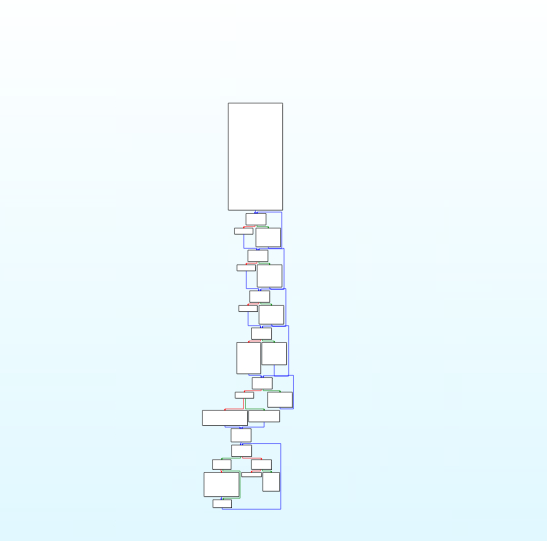
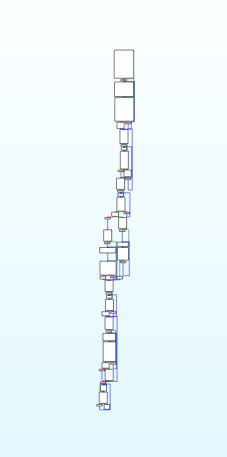
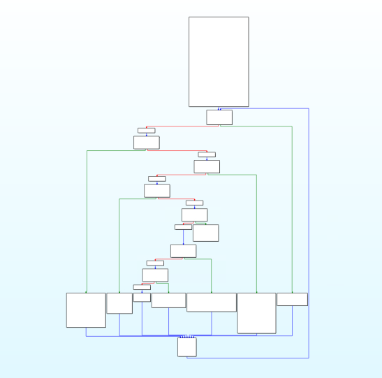
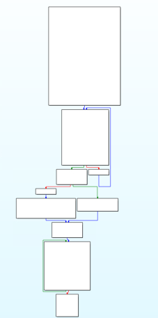
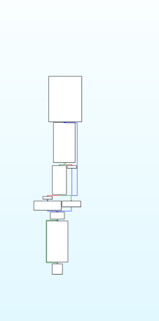

# Introduction

Here all the test on Pluto obfuscator are made based on this initial code [click here](../../demo-v1.c)...
This file aim to show some testing on pluto, to demonstrate the changes after the obfuscation, on the 4 mosts commmon one for our cases.

# Original DemoV1 Graph View

## Bogus Control Flow

- [executable](bogus.d/bogus)
- [intermediate representation](bogus.d/bogus.ll)

### Obfuscated Graph view

## Flattening

- [executable](flattening.d/flattening)
- [intermediate representation](flattening.d/flattening.ll)

### Obfuscated Graph view

## Substitution
- [executable](substitution.d/substitution)
- [intermediate representation](substitution.d/substitution.ll)

### Obfuscated Graph view

## Mixed Boolean Arithmetic
- [executable](mba.d/mba)
- [intermediate representation](mba.d/mba.ll)

## Obfuscated Graph view
